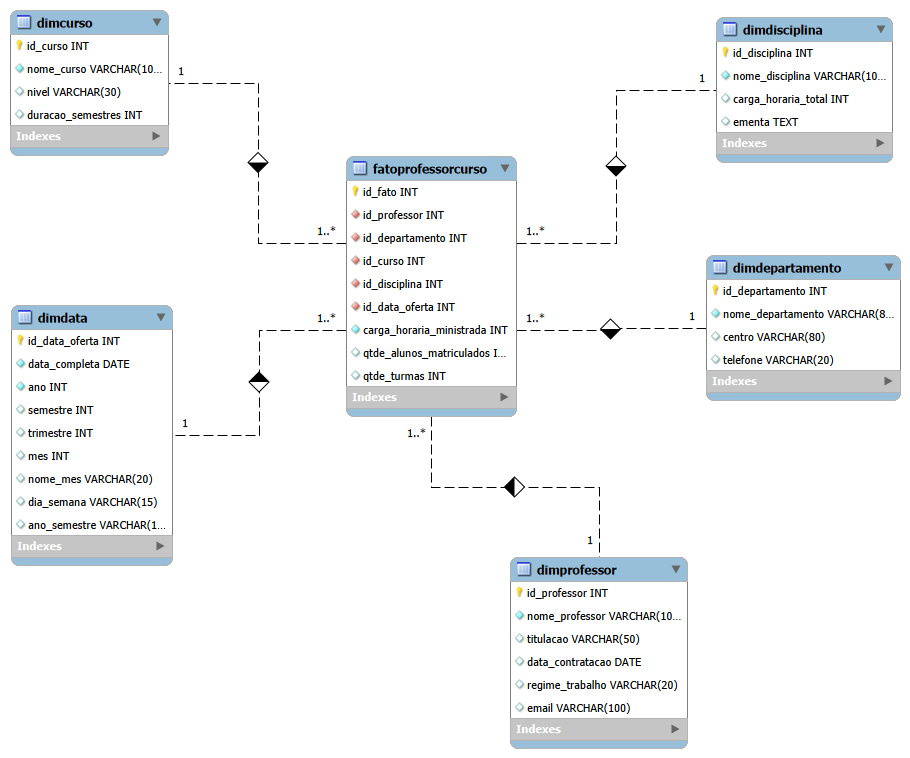
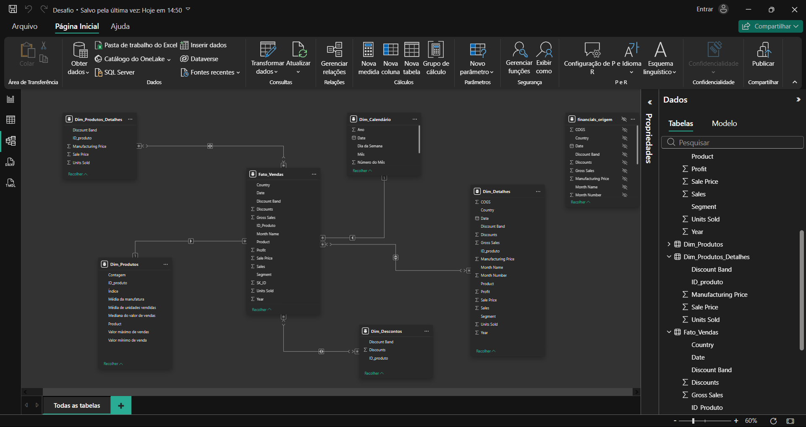

# Formação Power BI - Desafios de Projeto

Este repositório contém uma série de projetos práticos desenvolvidos durante o Bootcamp Klabin - Excel e Power BI Dashboards 2026 (DIO, abrangendo desde a criação de visuais básicos até a modelagem dimensional avançada, integração com nuvem (Azure/MySQL) e implementação de parâmetros dinâmicos.

## Sumário
1. Desafio 1: Enviado no repositório [Desafio de Projeto Lógico de Banco de Dados](https://github.com/alvesfarias74/Banco-de-dados-para-o-cenario-de-E-commerce.git)
2. [Desafio 2: Dashboard de Vendas](#projeto-2-dashboard-de-vendas)
3. [Desafio 3: Relatório Gerencial com Navegabilidade](#projeto-3-relatório-gerencial-com-navegabilidade)
4. [Desafio 4: Integração com MySQL no Azure e Transformação de Dados](#projeto-4-integração-com-mysql-no-azure-e-transformação-de-dados)
5. [Desafio 5: Modelagem Dimensional (Star Schema) - Foco Professor](#projeto-5-modelagem-dimensional-star-schema---foco-professor)
6. [Desafio 6: Dashboard de E-commerce com DAX e Star Schema](#projeto-6-dashboard-de-e-commerce-com-dax-e-star-schema)
7. [Desafios 7 & 8: UX Design e Relatórios Financeiros](#projetos-7--8-ux-design-e-relatórios-financeiros)
8. [Desafio 9: Relatórios Dinâmicos com Parâmetros e Storytelling](#projeto-9-relatórios-dinâmicos-com-parâmetros-e-storytelling)

---

## Desafio 2: Dashboard de Vendas
**Objetivo:** Praticar a criação de visuais e disposição de elementos.
- Replicação de duas páginas padrão do curso utilizando a base de dados *sample*.
- Criação de uma terceira página personalizada contendo:
    - **Mapa 1:** Soma de vendas e unidades vendidas por país.
    - **Mapa 2:** Soma de lucro (*profit*) por país.
    - **Gráfico de Pizza:** Lucro por segmento.
- Ajustes de nomes de visuais para clareza e configuração de *tooltips*.

### Relatórios Sample_Financials
Página 1:


Página 2:


Página 3:


## Desafio 3: Relatório Gerencial com Navegabilidade
**Objetivo:** Criar um relatório elaborado focado em experiência de navegação.
- Utilização da base *financials*.
- Implementação de **botões de navegação** e segmentadores com imagens.
- Uso de **indicadores (bookmarks)** para alternar visuais sobre o mesmo assunto.
- Estruturação de layout profissional em duas páginas.

### Relatório Criativo
Página 1:


Página 2:


## Desafio 4: Integração com MySQL no Azure e Transformação de Dados
**Objetivo:** Conectar o Power BI a um banco de dados na nuvem e realizar ETL avançado.
- **Infraestrutura:** Criação de instância MySQL na Azure, configuração de firewall e conexão via MySQL Workbench.
- **Transformação de Dados (Power Query):**
    - Limpeza de nulos e tratamento de dados monetários (*double* preciso).
    - Separação de colunas complexas e mescla de consultas (Employee + Department).
    - Criação de hierarquia de gerentes (Self-join na tabela de colaboradores).
    - Mescla de nomes e sobrenomes para uma coluna única.
    - Combinação de Departamento e Localização para criação de chaves únicas.

### Observação:
Embora o roteiro preveja o provisionamento na Azure, instabilidades no acesso à conta impossibilitaram a conexão remota. O fluxo de trabalho, entretanto, foi validado localmente seguindo rigorosamente os critérios de transformação e limpeza de dados exigidos.

## Desafio 5: Modelagem Dimensional (Star Schema) - Foco Professor
**Objetivo:** Transformar um diagrama relacional em um esquema em estrela.
- **Fato:** Dados sobre professores, cursos ministrados e departamentos.
- **Dimensões:** Tabelas de detalhes contextuais (excluindo dados de alunos).
- **Tabela Calendário:** Criação de uma dimensão de datas para suportar análises temporais (granularidade diversa).

### Modelo Dimensional


## Desafio 6: Dashboard de E-commerce com DAX e Star Schema
**Objetivo:** Modelagem avançada a partir de uma tabela única utilizando DAX.
- Decomposição da tabela `Financial Sample` em:
    - `F_Vendas`: Tabela fato com SK e chaves estrangeiras.
    - `D_Produtos`, `D_Produtos_Detalhes`, `D_Descontos` e `D_Detalhes`.
- **DAX:** Criação da tabela `D_Calendário` utilizando a função `CALENDAR()`.
- Uso de colunas condicionais e agrupamentos para organização do modelo.

### Modelo Star Schema das Tabelas Dimensão e Fato


## Projeto de Data Analytics com Power BI
**Objetivo:**  
Desenvolver e atualizar um relatório em Power BI com foco na **experiência do usuário (UX)**, priorizando clareza, navegação intuitiva e organização visual.

### Pontos considerados
- Criação da **página de detalhes**, conforme apresentado no desafio de projeto.
- Planejamento da **disposição dos visuais**, considerando a forma como o cliente irá consumir o conteúdo.
- Aplicação dos princípios de **Posicionamento, Contraste e Proporção Áurea** para melhor leitura e hierarquia da informação.
- Estruturação do relatório com **até duas páginas**, podendo variar conforme a disposição dos visuais.
- Criação das **medidas necessárias** para suportar as análises propostas.

### Navegação e Interação
- Implementação de **menus de navegação estilizados** nas páginas do relatório.
- Utilização de **botões interativos** que destaquem visualmente a seleção atual do usuário.

### Visuais que podem compor o relatório
- Visuais destacando os **TOP 3 Produtos**.
- Análise dos **principais países** em termos de vendas e/ou lucro (profit) ou outro campo relevante.
- **Gráfico de dispersão** relacionando Unidades Vendidas e Vendas por mês.
- Visuais de **agrupamento de dados** para identificação de padrões.
- Visuais de **compartimentação dos dados** para análises segmentadas.

### Páginas Desenvolvidas no Desafio de Projeto 7

Página 1:


Página 2:


Página 3:


## Desafio 8: UX Design e Relatórios Financeiros
**Objetivo:** Atualizar relatórios focando na experiência do usuário (UX).
- Aplicação de princípios de **Posicionamento, Contraste e Proporção Áurea**.
- Criação de menus de navegação estilizados em todas as páginas (relatório de 3 páginas).
- Foco em botões que destacam a seleção atual do usuário.

### Páginas Desenvolvidas/Atualizadas no Desafio de Projeto 8

Página 1:


Página 2:


Página 3:


Página 3:


## Desafio 9: Relatórios Dinâmicos com Parâmetros e Storytelling
**Objetivo:** Utilizar parâmetros de campo para criar visuais interativos e dinâmicos.
- Criação de visuais baseados em:
    - **Parâmetros de Categorias:** Alternância entre diferentes dimensões.
    - **Parâmetros de Valores:** Alternância entre métricas como lucro e vendas.
- Foco em **Storytelling**: Criação de uma página narrativa apresentando os dados de forma lógica para o cliente.

---
*Este repositório foi criado como parte dos desafios de projeto do Bootcamp Klabin - Excel e Power BI Dashboards 2026 promovido pela DIO.*
```
